@startuml

com_github_forax_umldoc_core_Entity "1" -->  "*" com_github_forax_umldoc_core_Modifier : Not defined
com_github_forax_umldoc_core_Entity "1" -->  "*" com_github_forax_umldoc_core_Field : Not defined
com_github_forax_umldoc_core_Entity "1" -->  "*" com_github_forax_umldoc_core_Method_Parameter : Not defined
com_github_forax_umldoc_core_Method "1" -->  "*" com_github_forax_umldoc_core_Modifier : Not defined
com_github_forax_umldoc_core_Method "1" -->  "*" com_github_forax_umldoc_core_Method_Parameter : Not defined
com_github_magickoders_JarReader_MyVisitor "1" -->  "*" com_github_forax_umldoc_core_Entity_Stereotype : Not defined
com_github_donnebelin_umldoc_classfile_JarParser "1" -->  "*" com_github_forax_umldoc_core_Entity_Stereotype : Not defined
com_github_donnebelin_umldoc_classfile_JarParser "1" -->  "*" com_github_forax_umldoc_core_AssociationDependency : Not defined
    class com_github_forax_umldoc_core_SubtypeDependency {
      -supertype: Entity
			-subtype: Entity
    }

    class com_github_forax_umldoc_core_Package {
      -dependencies: List<Dependency>
			-entities: List<Entity>
			-name: String
    }

    class com_github_forax_umldoc_core_Entity_Stereotype {
      +RECORD: Entity$Stereotype
			-_VALUES: Entity$Stereotype[]
			+ANNOTATION: Entity$Stereotype
			+ENUM: Entity$Stereotype
			+CLASS: Entity$Stereotype
			+ABSTRACT: Entity$Stereotype
			+INTERFACE: Entity$Stereotype
    }

    class com_github_forax_umldoc_core_Modifier {
      +FINAL: Modifier
			+STATIC: Modifier
			+PRIVATE: Modifier
			+PUBLIC: Modifier
			+PACKAGE: Modifier
			-_VALUES: Modifier[]
			+PROTECTED: Modifier
    }

    class com_github_forax_umldoc_classfile_ClassFileParser_EntityBuilder {
      -name: String
    }

    class com_github_forax_umldoc_core_Entity {
      -modifiers: Set<Modifier>
			-methods: List<Method>
			-fields: List<Field>
			-name: String
			-stereotype: Entity$Stereotype
    }

    class com_github_forax_umldoc_core_Field {
      -modifiers: Set<Modifier>
			-type: String
			-name: String
    }

    class com_github_forax_umldoc_core_Method_Parameter {
      -type: String
			-name: String
    }

    class com_github_forax_umldoc_core_Method {
      -modifiers: Set<Modifier>
			-returnType: String
			-name: String
			-parameters: List<Method_Parameter>
    }

    class com_github_forax_umldoc_classfile_ClassFileParser_1 {
       val_entityBuilder: ClassFileParser$EntityBuilder
    }

    class com_github_forax_umldoc_core_AssociationDependency {
      -left: AssociationDependency$Side
			-right: AssociationDependency$Side
    }

    class com_github_forax_umldoc_core_AssociationDependency_Cardinality {
      +ZERO_OR_ONE: AssociationDependency$Cardinality
			+ONLY_ONE: AssociationDependency$Cardinality
			-_VALUES: AssociationDependency$Cardinality[]
			+MANY: AssociationDependency$Cardinality
    }

    class com_github_forax_umldoc_core_AssociationDependency_Side {
      -entity: Entity
			-navigability: boolean
			-label: Optional<String>
			-cardinality: AssociationDependency$Cardinality
    }

@enduml

```mermaid
classDiagram
    direction TB

    class com_github_forax_umldoc_core_SubtypeDependency {
      -supertype: Entity
			-subtype: Entity
    }

    class com_github_forax_umldoc_core_Package {
      -dependencies: List[Dependency]
			-entities: List[Entity]
			-name: String
    }

    class com_github_forax_umldoc_core_Entity_Stereotype {
      +RECORD: Entity$Stereotype
			-_VALUES: Entity$Stereotype[]
			+ANNOTATION: Entity$Stereotype
			+ENUM: Entity$Stereotype
			+CLASS: Entity$Stereotype
			+ABSTRACT: Entity$Stereotype
			+INTERFACE: Entity$Stereotype
    }

    class com_github_forax_umldoc_core_Modifier {
      +FINAL: Modifier
			+STATIC: Modifier
			+PRIVATE: Modifier
			+PUBLIC: Modifier
			+PACKAGE: Modifier
			-_VALUES: Modifier[]
			+PROTECTED: Modifier
    }

    class com_github_forax_umldoc_classfile_ClassFileParser_EntityBuilder {
      -name: String
    }

    class com_github_forax_umldoc_core_Entity {
      -modifiers: Set[Modifier]
			-methods: List[Method]
			-fields: List[Field]
			-name: String
			-stereotype: Entity$Stereotype
    }

    class com_github_forax_umldoc_core_Field {
      -modifiers: Set[Modifier]
			-type: String
			-name: String
    }

    class com_github_forax_umldoc_core_Method_Parameter {
      -type: String
			-name: String
    }

    class com_github_forax_umldoc_core_Method {
      -modifiers: Set[Modifier]
			-returnType: String
			-name: String
			-parameters: List[Method_Parameter]
    }

    class com_github_forax_umldoc_classfile_ClassFileParser_1 {
       val_entityBuilder: ClassFileParser$EntityBuilder
    }

    class com_github_forax_umldoc_core_AssociationDependency {
      -left: AssociationDependency$Side
			-right: AssociationDependency$Side
    }

    class com_github_forax_umldoc_core_AssociationDependency_Cardinality {
      +ZERO_OR_ONE: AssociationDependency$Cardinality
			+ONLY_ONE: AssociationDependency$Cardinality
			-_VALUES: AssociationDependency$Cardinality[]
			+MANY: AssociationDependency$Cardinality
    }

    class com_github_forax_umldoc_core_AssociationDependency_Side {
      -entity: Entity
			-navigability: boolean
			-label: Optional[String]
			-cardinality: AssociationDependency$Cardinality
    }

```

