@startuml

    class com_github_forax_umldoc_core_AssociationDependency {
      -entities: HashSet<Entity>
			+ONLY_ONE: AssociationDependency$Cardinality
			-entity: Entity
			-navigability: boolean
			-cardinality: AssociationDependency$Cardinality
			-fields: HashSet<Field>
			-name: String
			-_VALUES: AssociationDependency$Cardinality[]
			-label: Optional<String>
			+MANY: AssociationDependency$Cardinality
			 val_entityBuilder: ClassFileParser$EntityBuilder
			+ZERO_OR_ONE: AssociationDependency$Cardinality
    }

    class com_github_forax_umldoc_classfile_ClassFileParser {
      -entities: HashSet<Entity>
			-fields: HashSet<Field>
			-name: String
			 val_entityBuilder: ClassFileParser$EntityBuilder
    }

    class com_github_forax_umldoc_core_Field {
      -modifiers: Set<Modifier>
			+ONLY_ONE: AssociationDependency$Cardinality
			-cardinality: AssociationDependency$Cardinality
			+ABSTRACT: Entity$Stereotype
			-name: String
			 val_entityBuilder: ClassFileParser$EntityBuilder
			+ZERO_OR_ONE: AssociationDependency$Cardinality
			-stereotype: Entity$Stereotype
			-entities: HashSet<Entity>
			-entity: Entity
			+INTERFACE: Entity$Stereotype
			-_VALUES: Entity$Stereotype[]
			-name: String
			-label: Optional<String>
			+MANY: AssociationDependency$Cardinality
			+RECORD: Entity$Stereotype
			-right: AssociationDependency$Side
			-navigability: boolean
			-_VALUES: AssociationDependency$Cardinality[]
			+ANNOTATION: Entity$Stereotype
			-fields: List<Field>
			+ENUM: Entity$Stereotype
			-methods: List<Method>
			-left: AssociationDependency$Side
			-fields: HashSet<Field>
			+CLASS: Entity$Stereotype
    }

    class com_github_forax_umldoc_core_Method {
      -modifiers: Set<Modifier>
			+ONLY_ONE: AssociationDependency$Cardinality
			-cardinality: AssociationDependency$Cardinality
			+ABSTRACT: Entity$Stereotype
			-name: String
			 val_entityBuilder: ClassFileParser$EntityBuilder
			+ZERO_OR_ONE: AssociationDependency$Cardinality
			-stereotype: Entity$Stereotype
			-entities: HashSet<Entity>
			-entity: Entity
			+INTERFACE: Entity$Stereotype
			-_VALUES: Entity$Stereotype[]
			-name: String
			-label: Optional<String>
			+MANY: AssociationDependency$Cardinality
			+RECORD: Entity$Stereotype
			-right: AssociationDependency$Side
			-navigability: boolean
			-_VALUES: AssociationDependency$Cardinality[]
			+ANNOTATION: Entity$Stereotype
			-fields: List<Field>
			+ENUM: Entity$Stereotype
			-methods: List<Method>
			-left: AssociationDependency$Side
			-fields: HashSet<Field>
			+CLASS: Entity$Stereotype
			-type: String
    }

    class com_github_forax_umldoc_core_Package {
      -modifiers: Set<Modifier>
			+ONLY_ONE: AssociationDependency$Cardinality
			-cardinality: AssociationDependency$Cardinality
			+ABSTRACT: Entity$Stereotype
			+PUBLIC: Modifier
			-_VALUES: Modifier[]
			-name: String
			 val_entityBuilder: ClassFileParser$EntityBuilder
			+ZERO_OR_ONE: AssociationDependency$Cardinality
			-stereotype: Entity$Stereotype
			-returnType: String
			-entities: HashSet<Entity>
			-entity: Entity
			+INTERFACE: Entity$Stereotype
			-_VALUES: Entity$Stereotype[]
			-name: String
			-label: Optional<String>
			+PACKAGE: Modifier
			+MANY: AssociationDependency$Cardinality
			+PRIVATE: Modifier
			+FINAL: Modifier
			+RECORD: Entity$Stereotype
			+STATIC: Modifier
			-right: AssociationDependency$Side
			-navigability: boolean
			-_VALUES: AssociationDependency$Cardinality[]
			+ANNOTATION: Entity$Stereotype
			-fields: List<Field>
			+ENUM: Entity$Stereotype
			-methods: List<Method>
			-parameters: List<Method_Parameter>
			-left: AssociationDependency$Side
			+PROTECTED: Modifier
			-fields: HashSet<Field>
			+CLASS: Entity$Stereotype
			-type: String
    }

    class com_github_forax_umldoc_core_Modifier {
      -modifiers: Set<Modifier>
			+ONLY_ONE: AssociationDependency$Cardinality
			-cardinality: AssociationDependency$Cardinality
			+ABSTRACT: Entity$Stereotype
			-name: String
			 val_entityBuilder: ClassFileParser$EntityBuilder
			+ZERO_OR_ONE: AssociationDependency$Cardinality
			-stereotype: Entity$Stereotype
			-returnType: String
			-entities: HashSet<Entity>
			-entity: Entity
			+INTERFACE: Entity$Stereotype
			-_VALUES: Entity$Stereotype[]
			-name: String
			-label: Optional<String>
			+MANY: AssociationDependency$Cardinality
			+RECORD: Entity$Stereotype
			-right: AssociationDependency$Side
			-navigability: boolean
			-_VALUES: AssociationDependency$Cardinality[]
			+ANNOTATION: Entity$Stereotype
			-fields: List<Field>
			+ENUM: Entity$Stereotype
			-methods: List<Method>
			-parameters: List<Method_Parameter>
			-left: AssociationDependency$Side
			-fields: HashSet<Field>
			+CLASS: Entity$Stereotype
			-type: String
    }

    class com_github_forax_umldoc_core_AssociationDependency_Cardinality {
      -entities: HashSet<Entity>
			-fields: HashSet<Field>
			-name: String
			 val_entityBuilder: ClassFileParser$EntityBuilder
    }

    class com_github_forax_umldoc_core_Entity {
      -right: AssociationDependency$Side
			+ONLY_ONE: AssociationDependency$Cardinality
			-navigability: boolean
			-cardinality: AssociationDependency$Cardinality
			-_VALUES: AssociationDependency$Cardinality[]
			+ABSTRACT: Entity$Stereotype
			+ANNOTATION: Entity$Stereotype
			+ENUM: Entity$Stereotype
			 val_entityBuilder: ClassFileParser$EntityBuilder
			+ZERO_OR_ONE: AssociationDependency$Cardinality
			-entities: HashSet<Entity>
			-entity: Entity
			-left: AssociationDependency$Side
			+INTERFACE: Entity$Stereotype
			-_VALUES: Entity$Stereotype[]
			-fields: HashSet<Field>
			-name: String
			+CLASS: Entity$Stereotype
			-label: Optional<String>
			+MANY: AssociationDependency$Cardinality
			+RECORD: Entity$Stereotype
    }

    class com_github_forax_umldoc_core_Dependency {
      -right: AssociationDependency$Side
			+ONLY_ONE: AssociationDependency$Cardinality
			-navigability: boolean
			-cardinality: AssociationDependency$Cardinality
			-_VALUES: AssociationDependency$Cardinality[]
			 val_entityBuilder: ClassFileParser$EntityBuilder
			+ZERO_OR_ONE: AssociationDependency$Cardinality
			-entities: HashSet<Entity>
			-entity: Entity
			-left: AssociationDependency$Side
			-fields: HashSet<Field>
			-name: String
			-label: Optional<String>
			+MANY: AssociationDependency$Cardinality
    }

    class com_github_forax_umldoc_core_Method_Parameter {
      -modifiers: Set<Modifier>
			+ONLY_ONE: AssociationDependency$Cardinality
			-cardinality: AssociationDependency$Cardinality
			+ABSTRACT: Entity$Stereotype
			-name: String
			 val_entityBuilder: ClassFileParser$EntityBuilder
			+ZERO_OR_ONE: AssociationDependency$Cardinality
			-stereotype: Entity$Stereotype
			-entities: HashSet<Entity>
			-entity: Entity
			+INTERFACE: Entity$Stereotype
			-_VALUES: Entity$Stereotype[]
			-name: String
			-label: Optional<String>
			+MANY: AssociationDependency$Cardinality
			+RECORD: Entity$Stereotype
			-right: AssociationDependency$Side
			-navigability: boolean
			-_VALUES: AssociationDependency$Cardinality[]
			+ANNOTATION: Entity$Stereotype
			-fields: List<Field>
			+ENUM: Entity$Stereotype
			-methods: List<Method>
			-left: AssociationDependency$Side
			-fields: HashSet<Field>
			+CLASS: Entity$Stereotype
			-type: String
    }

    class com_github_forax_umldoc_core_SubtypeDependency {
      -modifiers: Set<Modifier>
			+ONLY_ONE: AssociationDependency$Cardinality
			-cardinality: AssociationDependency$Cardinality
			+ABSTRACT: Entity$Stereotype
			+PUBLIC: Modifier
			-_VALUES: Modifier[]
			-name: String
			 val_entityBuilder: ClassFileParser$EntityBuilder
			+ZERO_OR_ONE: AssociationDependency$Cardinality
			-stereotype: Entity$Stereotype
			-entities: List<Entity>
			-returnType: String
			-entities: HashSet<Entity>
			-entity: Entity
			+INTERFACE: Entity$Stereotype
			-_VALUES: Entity$Stereotype[]
			-name: String
			-label: Optional<String>
			+PACKAGE: Modifier
			+MANY: AssociationDependency$Cardinality
			+PRIVATE: Modifier
			+FINAL: Modifier
			+RECORD: Entity$Stereotype
			+STATIC: Modifier
			-right: AssociationDependency$Side
			-navigability: boolean
			-_VALUES: AssociationDependency$Cardinality[]
			+ANNOTATION: Entity$Stereotype
			-fields: List<Field>
			+ENUM: Entity$Stereotype
			-methods: List<Method>
			-parameters: List<Method_Parameter>
			-left: AssociationDependency$Side
			+PROTECTED: Modifier
			-fields: HashSet<Field>
			+CLASS: Entity$Stereotype
			-type: String
			-dependencies: List<Dependency>
    }

    class com_github_forax_umldoc_gen_MermaidGenerator {
      -modifiers: Set<Modifier>
			+ONLY_ONE: AssociationDependency$Cardinality
			-cardinality: AssociationDependency$Cardinality
			-subtype: Entity
			+ABSTRACT: Entity$Stereotype
			+PUBLIC: Modifier
			-_VALUES: Modifier[]
			-name: String
			 val_entityBuilder: ClassFileParser$EntityBuilder
			+ZERO_OR_ONE: AssociationDependency$Cardinality
			-stereotype: Entity$Stereotype
			-entities: List<Entity>
			-returnType: String
			-entities: HashSet<Entity>
			-entity: Entity
			+INTERFACE: Entity$Stereotype
			-_VALUES: Entity$Stereotype[]
			-name: String
			-label: Optional<String>
			+PACKAGE: Modifier
			+MANY: AssociationDependency$Cardinality
			+PRIVATE: Modifier
			+FINAL: Modifier
			+RECORD: Entity$Stereotype
			+STATIC: Modifier
			-right: AssociationDependency$Side
			-supertype: Entity
			-navigability: boolean
			-_VALUES: AssociationDependency$Cardinality[]
			+ANNOTATION: Entity$Stereotype
			-fields: List<Field>
			+ENUM: Entity$Stereotype
			-methods: List<Method>
			-parameters: List<Method_Parameter>
			-left: AssociationDependency$Side
			+PROTECTED: Modifier
			-fields: HashSet<Field>
			+CLASS: Entity$Stereotype
			-type: String
			-dependencies: List<Dependency>
    }

    class com_github_forax_umldoc_classfile_ClassFileParser_EntityBuilder {
      -entities: HashSet<Entity>
			-fields: HashSet<Field>
			 val_entityBuilder: ClassFileParser$EntityBuilder
    }

    class com_github_forax_umldoc_classfile_ClassFileParser_1 {
      -entities: HashSet<Entity>
			-fields: HashSet<Field>
    }

    class com_github_forax_umldoc_core_AssociationDependency_Side {
      -entities: HashSet<Entity>
			+ONLY_ONE: AssociationDependency$Cardinality
			-fields: HashSet<Field>
			-name: String
			-_VALUES: AssociationDependency$Cardinality[]
			+MANY: AssociationDependency$Cardinality
			 val_entityBuilder: ClassFileParser$EntityBuilder
			+ZERO_OR_ONE: AssociationDependency$Cardinality
    }

    class com_github_forax_umldoc_classfile_ModuleScrapper {
      -entities: HashSet<Entity>
			-fields: HashSet<Field>
			-name: String
			 val_entityBuilder: ClassFileParser$EntityBuilder
    }

    class com_github_forax_umldoc_core_Entity_Stereotype {
      -right: AssociationDependency$Side
			+ONLY_ONE: AssociationDependency$Cardinality
			-navigability: boolean
			-cardinality: AssociationDependency$Cardinality
			-_VALUES: AssociationDependency$Cardinality[]
			 val_entityBuilder: ClassFileParser$EntityBuilder
			+ZERO_OR_ONE: AssociationDependency$Cardinality
			-entities: HashSet<Entity>
			-entity: Entity
			-left: AssociationDependency$Side
			-fields: HashSet<Field>
			-name: String
			-label: Optional<String>
			+MANY: AssociationDependency$Cardinality
    }

    class com_github_forax_umldoc_gen_Generator {
      -modifiers: Set<Modifier>
			+ONLY_ONE: AssociationDependency$Cardinality
			-cardinality: AssociationDependency$Cardinality
			-subtype: Entity
			+ABSTRACT: Entity$Stereotype
			+PUBLIC: Modifier
			-_VALUES: Modifier[]
			-name: String
			 val_entityBuilder: ClassFileParser$EntityBuilder
			+ZERO_OR_ONE: AssociationDependency$Cardinality
			-stereotype: Entity$Stereotype
			-entities: List<Entity>
			-returnType: String
			-entities: HashSet<Entity>
			-entity: Entity
			+INTERFACE: Entity$Stereotype
			-_VALUES: Entity$Stereotype[]
			-name: String
			-label: Optional<String>
			+PACKAGE: Modifier
			+MANY: AssociationDependency$Cardinality
			+PRIVATE: Modifier
			+FINAL: Modifier
			+RECORD: Entity$Stereotype
			+STATIC: Modifier
			-right: AssociationDependency$Side
			-supertype: Entity
			-navigability: boolean
			-_VALUES: AssociationDependency$Cardinality[]
			+ANNOTATION: Entity$Stereotype
			-fields: List<Field>
			+ENUM: Entity$Stereotype
			-methods: List<Method>
			-parameters: List<Method_Parameter>
			-left: AssociationDependency$Side
			+PROTECTED: Modifier
			-fields: HashSet<Field>
			+CLASS: Entity$Stereotype
			-type: String
			-dependencies: List<Dependency>
    }

    class com_github_forax_umldoc_gen_PlantUmlGenerator {
      -modifiers: Set<Modifier>
			+ONLY_ONE: AssociationDependency$Cardinality
			-cardinality: AssociationDependency$Cardinality
			-subtype: Entity
			+ABSTRACT: Entity$Stereotype
			+PUBLIC: Modifier
			-_VALUES: Modifier[]
			-name: String
			 val_entityBuilder: ClassFileParser$EntityBuilder
			+ZERO_OR_ONE: AssociationDependency$Cardinality
			-stereotype: Entity$Stereotype
			-entities: List<Entity>
			-returnType: String
			-entities: HashSet<Entity>
			-entity: Entity
			+INTERFACE: Entity$Stereotype
			-_VALUES: Entity$Stereotype[]
			-name: String
			-label: Optional<String>
			+PACKAGE: Modifier
			+MANY: AssociationDependency$Cardinality
			+PRIVATE: Modifier
			+FINAL: Modifier
			+RECORD: Entity$Stereotype
			+STATIC: Modifier
			-right: AssociationDependency$Side
			-supertype: Entity
			-navigability: boolean
			-_VALUES: AssociationDependency$Cardinality[]
			+ANNOTATION: Entity$Stereotype
			-fields: List<Field>
			+ENUM: Entity$Stereotype
			-methods: List<Method>
			-parameters: List<Method_Parameter>
			-left: AssociationDependency$Side
			+PROTECTED: Modifier
			-fields: HashSet<Field>
			+CLASS: Entity$Stereotype
			-type: String
			-dependencies: List<Dependency>
    }

@enduml

```mermaid
classDiagram
    direction TB

    class com_github_forax_umldoc_core_AssociationDependency {
      -entities: HashSet[Entity]
			+ONLY_ONE: AssociationDependency$Cardinality
			-entity: Entity
			-navigability: boolean
			-cardinality: AssociationDependency$Cardinality
			-fields: HashSet[Field]
			-name: String
			-_VALUES: AssociationDependency$Cardinality[]
			-label: Optional[String]
			+MANY: AssociationDependency$Cardinality
			 val_entityBuilder: ClassFileParser$EntityBuilder
			+ZERO_OR_ONE: AssociationDependency$Cardinality
    }

    class com_github_forax_umldoc_classfile_ClassFileParser {
      -entities: HashSet[Entity]
			-fields: HashSet[Field]
			-name: String
			 val_entityBuilder: ClassFileParser$EntityBuilder
    }

    class com_github_forax_umldoc_core_Field {
      -modifiers: Set[Modifier]
			+ONLY_ONE: AssociationDependency$Cardinality
			-cardinality: AssociationDependency$Cardinality
			+ABSTRACT: Entity$Stereotype
			-name: String
			 val_entityBuilder: ClassFileParser$EntityBuilder
			+ZERO_OR_ONE: AssociationDependency$Cardinality
			-stereotype: Entity$Stereotype
			-entities: HashSet[Entity]
			-entity: Entity
			+INTERFACE: Entity$Stereotype
			-_VALUES: Entity$Stereotype[]
			-name: String
			-label: Optional[String]
			+MANY: AssociationDependency$Cardinality
			+RECORD: Entity$Stereotype
			-right: AssociationDependency$Side
			-navigability: boolean
			-_VALUES: AssociationDependency$Cardinality[]
			+ANNOTATION: Entity$Stereotype
			-fields: List[Field]
			+ENUM: Entity$Stereotype
			-methods: List[Method]
			-left: AssociationDependency$Side
			-fields: HashSet[Field]
			+CLASS: Entity$Stereotype
    }

    class com_github_forax_umldoc_core_Method {
      -modifiers: Set[Modifier]
			+ONLY_ONE: AssociationDependency$Cardinality
			-cardinality: AssociationDependency$Cardinality
			+ABSTRACT: Entity$Stereotype
			-name: String
			 val_entityBuilder: ClassFileParser$EntityBuilder
			+ZERO_OR_ONE: AssociationDependency$Cardinality
			-stereotype: Entity$Stereotype
			-entities: HashSet[Entity]
			-entity: Entity
			+INTERFACE: Entity$Stereotype
			-_VALUES: Entity$Stereotype[]
			-name: String
			-label: Optional[String]
			+MANY: AssociationDependency$Cardinality
			+RECORD: Entity$Stereotype
			-right: AssociationDependency$Side
			-navigability: boolean
			-_VALUES: AssociationDependency$Cardinality[]
			+ANNOTATION: Entity$Stereotype
			-fields: List[Field]
			+ENUM: Entity$Stereotype
			-methods: List[Method]
			-left: AssociationDependency$Side
			-fields: HashSet[Field]
			+CLASS: Entity$Stereotype
			-type: String
    }

    class com_github_forax_umldoc_core_Package {
      -modifiers: Set[Modifier]
			+ONLY_ONE: AssociationDependency$Cardinality
			-cardinality: AssociationDependency$Cardinality
			+ABSTRACT: Entity$Stereotype
			+PUBLIC: Modifier
			-_VALUES: Modifier[]
			-name: String
			 val_entityBuilder: ClassFileParser$EntityBuilder
			+ZERO_OR_ONE: AssociationDependency$Cardinality
			-stereotype: Entity$Stereotype
			-returnType: String
			-entities: HashSet[Entity]
			-entity: Entity
			+INTERFACE: Entity$Stereotype
			-_VALUES: Entity$Stereotype[]
			-name: String
			-label: Optional[String]
			+PACKAGE: Modifier
			+MANY: AssociationDependency$Cardinality
			+PRIVATE: Modifier
			+FINAL: Modifier
			+RECORD: Entity$Stereotype
			+STATIC: Modifier
			-right: AssociationDependency$Side
			-navigability: boolean
			-_VALUES: AssociationDependency$Cardinality[]
			+ANNOTATION: Entity$Stereotype
			-fields: List[Field]
			+ENUM: Entity$Stereotype
			-methods: List[Method]
			-parameters: List[Method_Parameter]
			-left: AssociationDependency$Side
			+PROTECTED: Modifier
			-fields: HashSet[Field]
			+CLASS: Entity$Stereotype
			-type: String
    }

    class com_github_forax_umldoc_core_Modifier {
      -modifiers: Set[Modifier]
			+ONLY_ONE: AssociationDependency$Cardinality
			-cardinality: AssociationDependency$Cardinality
			+ABSTRACT: Entity$Stereotype
			-name: String
			 val_entityBuilder: ClassFileParser$EntityBuilder
			+ZERO_OR_ONE: AssociationDependency$Cardinality
			-stereotype: Entity$Stereotype
			-returnType: String
			-entities: HashSet[Entity]
			-entity: Entity
			+INTERFACE: Entity$Stereotype
			-_VALUES: Entity$Stereotype[]
			-name: String
			-label: Optional[String]
			+MANY: AssociationDependency$Cardinality
			+RECORD: Entity$Stereotype
			-right: AssociationDependency$Side
			-navigability: boolean
			-_VALUES: AssociationDependency$Cardinality[]
			+ANNOTATION: Entity$Stereotype
			-fields: List[Field]
			+ENUM: Entity$Stereotype
			-methods: List[Method]
			-parameters: List[Method_Parameter]
			-left: AssociationDependency$Side
			-fields: HashSet[Field]
			+CLASS: Entity$Stereotype
			-type: String
    }

    class com_github_forax_umldoc_core_AssociationDependency_Cardinality {
      -entities: HashSet[Entity]
			-fields: HashSet[Field]
			-name: String
			 val_entityBuilder: ClassFileParser$EntityBuilder
    }

    class com_github_forax_umldoc_core_Entity {
      -right: AssociationDependency$Side
			+ONLY_ONE: AssociationDependency$Cardinality
			-navigability: boolean
			-cardinality: AssociationDependency$Cardinality
			-_VALUES: AssociationDependency$Cardinality[]
			+ABSTRACT: Entity$Stereotype
			+ANNOTATION: Entity$Stereotype
			+ENUM: Entity$Stereotype
			 val_entityBuilder: ClassFileParser$EntityBuilder
			+ZERO_OR_ONE: AssociationDependency$Cardinality
			-entities: HashSet[Entity]
			-entity: Entity
			-left: AssociationDependency$Side
			+INTERFACE: Entity$Stereotype
			-_VALUES: Entity$Stereotype[]
			-fields: HashSet[Field]
			-name: String
			+CLASS: Entity$Stereotype
			-label: Optional[String]
			+MANY: AssociationDependency$Cardinality
			+RECORD: Entity$Stereotype
    }

    class com_github_forax_umldoc_core_Dependency {
      -right: AssociationDependency$Side
			+ONLY_ONE: AssociationDependency$Cardinality
			-navigability: boolean
			-cardinality: AssociationDependency$Cardinality
			-_VALUES: AssociationDependency$Cardinality[]
			 val_entityBuilder: ClassFileParser$EntityBuilder
			+ZERO_OR_ONE: AssociationDependency$Cardinality
			-entities: HashSet[Entity]
			-entity: Entity
			-left: AssociationDependency$Side
			-fields: HashSet[Field]
			-name: String
			-label: Optional[String]
			+MANY: AssociationDependency$Cardinality
    }

    class com_github_forax_umldoc_core_Method_Parameter {
      -modifiers: Set[Modifier]
			+ONLY_ONE: AssociationDependency$Cardinality
			-cardinality: AssociationDependency$Cardinality
			+ABSTRACT: Entity$Stereotype
			-name: String
			 val_entityBuilder: ClassFileParser$EntityBuilder
			+ZERO_OR_ONE: AssociationDependency$Cardinality
			-stereotype: Entity$Stereotype
			-entities: HashSet[Entity]
			-entity: Entity
			+INTERFACE: Entity$Stereotype
			-_VALUES: Entity$Stereotype[]
			-name: String
			-label: Optional[String]
			+MANY: AssociationDependency$Cardinality
			+RECORD: Entity$Stereotype
			-right: AssociationDependency$Side
			-navigability: boolean
			-_VALUES: AssociationDependency$Cardinality[]
			+ANNOTATION: Entity$Stereotype
			-fields: List[Field]
			+ENUM: Entity$Stereotype
			-methods: List[Method]
			-left: AssociationDependency$Side
			-fields: HashSet[Field]
			+CLASS: Entity$Stereotype
			-type: String
    }

    class com_github_forax_umldoc_core_SubtypeDependency {
      -modifiers: Set[Modifier]
			+ONLY_ONE: AssociationDependency$Cardinality
			-cardinality: AssociationDependency$Cardinality
			+ABSTRACT: Entity$Stereotype
			+PUBLIC: Modifier
			-_VALUES: Modifier[]
			-name: String
			 val_entityBuilder: ClassFileParser$EntityBuilder
			+ZERO_OR_ONE: AssociationDependency$Cardinality
			-stereotype: Entity$Stereotype
			-entities: List[Entity]
			-returnType: String
			-entities: HashSet[Entity]
			-entity: Entity
			+INTERFACE: Entity$Stereotype
			-_VALUES: Entity$Stereotype[]
			-name: String
			-label: Optional[String]
			+PACKAGE: Modifier
			+MANY: AssociationDependency$Cardinality
			+PRIVATE: Modifier
			+FINAL: Modifier
			+RECORD: Entity$Stereotype
			+STATIC: Modifier
			-right: AssociationDependency$Side
			-navigability: boolean
			-_VALUES: AssociationDependency$Cardinality[]
			+ANNOTATION: Entity$Stereotype
			-fields: List[Field]
			+ENUM: Entity$Stereotype
			-methods: List[Method]
			-parameters: List[Method_Parameter]
			-left: AssociationDependency$Side
			+PROTECTED: Modifier
			-fields: HashSet[Field]
			+CLASS: Entity$Stereotype
			-type: String
			-dependencies: List[Dependency]
    }

    class com_github_forax_umldoc_gen_MermaidGenerator {
      -modifiers: Set[Modifier]
			+ONLY_ONE: AssociationDependency$Cardinality
			-cardinality: AssociationDependency$Cardinality
			-subtype: Entity
			+ABSTRACT: Entity$Stereotype
			+PUBLIC: Modifier
			-_VALUES: Modifier[]
			-name: String
			 val_entityBuilder: ClassFileParser$EntityBuilder
			+ZERO_OR_ONE: AssociationDependency$Cardinality
			-stereotype: Entity$Stereotype
			-entities: List[Entity]
			-returnType: String
			-entities: HashSet[Entity]
			-entity: Entity
			+INTERFACE: Entity$Stereotype
			-_VALUES: Entity$Stereotype[]
			-name: String
			-label: Optional[String]
			+PACKAGE: Modifier
			+MANY: AssociationDependency$Cardinality
			+PRIVATE: Modifier
			+FINAL: Modifier
			+RECORD: Entity$Stereotype
			+STATIC: Modifier
			-right: AssociationDependency$Side
			-supertype: Entity
			-navigability: boolean
			-_VALUES: AssociationDependency$Cardinality[]
			+ANNOTATION: Entity$Stereotype
			-fields: List[Field]
			+ENUM: Entity$Stereotype
			-methods: List[Method]
			-parameters: List[Method_Parameter]
			-left: AssociationDependency$Side
			+PROTECTED: Modifier
			-fields: HashSet[Field]
			+CLASS: Entity$Stereotype
			-type: String
			-dependencies: List[Dependency]
    }

    class com_github_forax_umldoc_classfile_ClassFileParser_EntityBuilder {
      -entities: HashSet[Entity]
			-fields: HashSet[Field]
			 val_entityBuilder: ClassFileParser$EntityBuilder
    }

    class com_github_forax_umldoc_classfile_ClassFileParser_1 {
      -entities: HashSet[Entity]
			-fields: HashSet[Field]
    }

    class com_github_forax_umldoc_core_AssociationDependency_Side {
      -entities: HashSet[Entity]
			+ONLY_ONE: AssociationDependency$Cardinality
			-fields: HashSet[Field]
			-name: String
			-_VALUES: AssociationDependency$Cardinality[]
			+MANY: AssociationDependency$Cardinality
			 val_entityBuilder: ClassFileParser$EntityBuilder
			+ZERO_OR_ONE: AssociationDependency$Cardinality
    }

    class com_github_forax_umldoc_classfile_ModuleScrapper {
      -entities: HashSet[Entity]
			-fields: HashSet[Field]
			-name: String
			 val_entityBuilder: ClassFileParser$EntityBuilder
    }

    class com_github_forax_umldoc_core_Entity_Stereotype {
      -right: AssociationDependency$Side
			+ONLY_ONE: AssociationDependency$Cardinality
			-navigability: boolean
			-cardinality: AssociationDependency$Cardinality
			-_VALUES: AssociationDependency$Cardinality[]
			 val_entityBuilder: ClassFileParser$EntityBuilder
			+ZERO_OR_ONE: AssociationDependency$Cardinality
			-entities: HashSet[Entity]
			-entity: Entity
			-left: AssociationDependency$Side
			-fields: HashSet[Field]
			-name: String
			-label: Optional[String]
			+MANY: AssociationDependency$Cardinality
    }

    class com_github_forax_umldoc_gen_Generator {
      -modifiers: Set[Modifier]
			+ONLY_ONE: AssociationDependency$Cardinality
			-cardinality: AssociationDependency$Cardinality
			-subtype: Entity
			+ABSTRACT: Entity$Stereotype
			+PUBLIC: Modifier
			-_VALUES: Modifier[]
			-name: String
			 val_entityBuilder: ClassFileParser$EntityBuilder
			+ZERO_OR_ONE: AssociationDependency$Cardinality
			-stereotype: Entity$Stereotype
			-entities: List[Entity]
			-returnType: String
			-entities: HashSet[Entity]
			-entity: Entity
			+INTERFACE: Entity$Stereotype
			-_VALUES: Entity$Stereotype[]
			-name: String
			-label: Optional[String]
			+PACKAGE: Modifier
			+MANY: AssociationDependency$Cardinality
			+PRIVATE: Modifier
			+FINAL: Modifier
			+RECORD: Entity$Stereotype
			+STATIC: Modifier
			-right: AssociationDependency$Side
			-supertype: Entity
			-navigability: boolean
			-_VALUES: AssociationDependency$Cardinality[]
			+ANNOTATION: Entity$Stereotype
			-fields: List[Field]
			+ENUM: Entity$Stereotype
			-methods: List[Method]
			-parameters: List[Method_Parameter]
			-left: AssociationDependency$Side
			+PROTECTED: Modifier
			-fields: HashSet[Field]
			+CLASS: Entity$Stereotype
			-type: String
			-dependencies: List[Dependency]
    }

    class com_github_forax_umldoc_gen_PlantUmlGenerator {
      -modifiers: Set[Modifier]
			+ONLY_ONE: AssociationDependency$Cardinality
			-cardinality: AssociationDependency$Cardinality
			-subtype: Entity
			+ABSTRACT: Entity$Stereotype
			+PUBLIC: Modifier
			-_VALUES: Modifier[]
			-name: String
			 val_entityBuilder: ClassFileParser$EntityBuilder
			+ZERO_OR_ONE: AssociationDependency$Cardinality
			-stereotype: Entity$Stereotype
			-entities: List[Entity]
			-returnType: String
			-entities: HashSet[Entity]
			-entity: Entity
			+INTERFACE: Entity$Stereotype
			-_VALUES: Entity$Stereotype[]
			-name: String
			-label: Optional[String]
			+PACKAGE: Modifier
			+MANY: AssociationDependency$Cardinality
			+PRIVATE: Modifier
			+FINAL: Modifier
			+RECORD: Entity$Stereotype
			+STATIC: Modifier
			-right: AssociationDependency$Side
			-supertype: Entity
			-navigability: boolean
			-_VALUES: AssociationDependency$Cardinality[]
			+ANNOTATION: Entity$Stereotype
			-fields: List[Field]
			+ENUM: Entity$Stereotype
			-methods: List[Method]
			-parameters: List[Method_Parameter]
			-left: AssociationDependency$Side
			+PROTECTED: Modifier
			-fields: HashSet[Field]
			+CLASS: Entity$Stereotype
			-type: String
			-dependencies: List[Dependency]
    }

```

